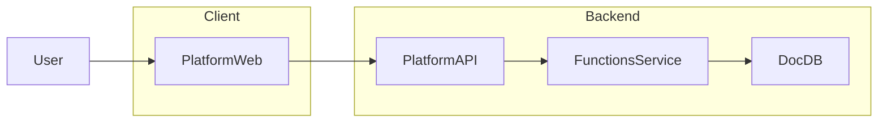

## BunBase Architecture Overview

BunBase is composed of four primary components that live in this monorepo:

- `platform-web/` – React + Vite dashboard used by developers.
- `platform/` – Go API server that handles auth, projects, and function deployment.
- `functions/` – Go control plane managing Bun workers that execute JS/TS functions.
- `docdb/` – Go document database used for persistent data.

### High-Level Data Flow

### Component Responsibilities

- **Platform Web (`platform-web/`)**
  - Implements the dashboard UI for logging in, managing projects, and viewing functions.
  - Communicates with the Platform API over HTTP.

- **Platform API (`platform/`)**
  - Manages users, sessions, projects, and function metadata.
  - Exposes REST endpoints for the dashboard and CLI.
  - Communicates with the Functions service via Unix socket IPC for function registration and deployment.

- **Functions Service (`functions/`)**
  - Manages long-lived Bun workers for executing user functions.
  - Provides an IPC interface used by the Platform API.
  - Stores function bundles and metadata on disk and in SQLite.

- **DocDB (`docdb/`)**
  - Provides an embedded document database.
  - Includes a server binary, interactive shell, and client libraries (including a TypeScript client).

### Service-Level Documentation

For detailed documentation of each component, see:

- DocDB: `docdb/README.md`, `docdb/docs/`
- Functions: `functions/README.md`, `functions/docs/`
- Platform API: `platform/README.md`
- Platform Web: `platform-web/README.md`

### Monorepo Layout

The overall repository layout and conventions are described in `planning/monorepo-structure.md`.
