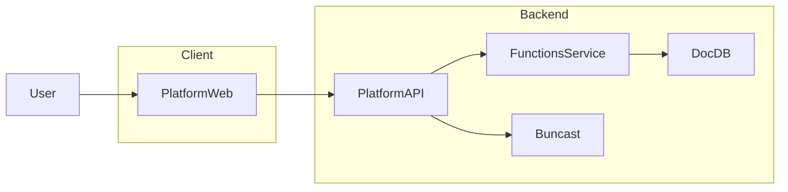

## BunBase Architecture Overview

BunBase is composed of five primary components that live in this monorepo:

- `platform-web/` – React + Vite dashboard used by developers.
- `platform/` – Go API server that handles auth, projects, and function deployment.
- `functions/` – Go control plane managing Bun workers that execute JS/TS functions.
- `buncast/` – Go Pub/Sub service (event bus) for cross-service events (e.g. function deployed).

### High-Level Data Flow

### Component Responsibilities

- **Platform Web (`platform-web/`)**
  - Implements the dashboard UI for logging in, managing projects, and viewing functions.
  - Communicates with the Platform API over HTTP.

- **Platform API (`platform/`)**
  - Manages users, sessions, projects, and function metadata.
  - Exposes REST endpoints for the dashboard and CLI.
  - Communicates with the Functions service via Unix socket IPC for function registration and deployment.

- **Functions Service (`functions/`)**
  - Manages long-lived Bun workers for executing user functions.
  - Provides an IPC interface used by the Platform API.
  - Stores function bundles and metadata on disk and in SQLite.

- **Buncast (`buncast/`)**
  - In-memory Publish-Subscribe broker for events (e.g. function deployed).
  - Exposes Unix socket IPC for server-to-server publish/subscribe and HTTP + SSE for dashboard/CLI.
  - Platform API can publish to Buncast on deploy when `--buncast-socket` is set.

### Inter-service RPC

When running in Docker, Platform and Tenant-auth can use TCP RPC to Bundoc, Functions, and KMS for lower latency. See [Inter-service RPC](inter-service-rpc.md) for env vars and protocol summary.

### Service-Level Documentation

For detailed documentation of each component, see:

- Functions: `functions/README.md`, `functions/docs/`
- Platform API: `platform/README.md`
- Platform Web: `platform-web/README.md`
- Buncast: `buncast/README.md`, `buncast/docs/`

### Monorepo Layout

The overall repository layout and conventions are described in `planning/monorepo-structure.md`.
