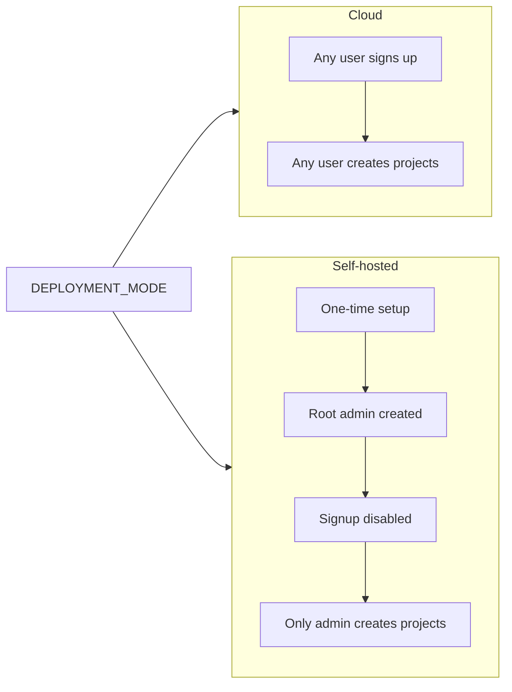

# Self-Hosted Deployment and Root Admin

## Current state

- **Cloud**: Any user can sign up ([platform/internal/handlers/auth.go](platform/internal/handlers/auth.go) `Register`) and any authenticated user can create projects ([platform/internal/handlers/projects.go](platform/internal/handlers/projects.go) `CreateProject` → [platform/internal/services/project.go](platform/internal/services/project.go) `CreateProject`).
- Platform and bun-auth share the same Postgres DB (`bunbase_system` in [docker-compose.yml](docker-compose.yml)); platform's `projects.owner_id` and `project_members.user_id` reference bun-auth's `users` table.
- No deployment mode or instance-level admin concept exists today.

## Target behavior

| Aspect                  | Cloud (default)                  | Self-hosted                            |
| ----------------------- | -------------------------------- | -------------------------------------- |
| Deployment mode         | `DEPLOYMENT_MODE=cloud` or unset | `DEPLOYMENT_MODE=self_hosted`          |
| First user              | Open signup                      | One-time setup creates root admin only |
| Signup after first user | Open                             | Disabled (403)                         |
| Who can create projects | Any authenticated user           | Only instance admin(s)                 |

Future (out of scope): invite team members via email; they get project access (and optionally "can create projects" later).

## Architecture overview

## Implementation plan

### 1. Configuration

- **Add** `DEPLOYMENT_MODE` to platform config (env `PLATFORM_DEPLOYMENT_MODE`).
- **Values**: `cloud` (default) | `self_hosted`.
- **Where**: Extend [platform/cmd/server/main.go](platform/cmd/server/main.go) `AppConfig` (or read via `os.Getenv`) and pass into handlers/services that need it. Prefer a single place (e.g. a small config struct or env helper) so middleware and handlers can branch on mode.

### 2. Database: instance admins

- **New migration** in [platform/migrations/](platform/migrations/):
  - Table `instance_admins`:
    - `user_id UUID PRIMARY KEY REFERENCES users(id) ON DELETE CASCADE`
  - One row per root admin (supports multiple admins later; for v1 only the bootstrap user is inserted).
- **No** separate `instance_config` table for v1: deployment mode comes from env; "setup complete" is inferred by "at least one row in `instance_admins`" when mode is `self_hosted`.

### 3. Instance service (platform)

- **New** `platform/internal/services/instance.go` (or `instance_admin.go`):
  - `IsInstanceAdmin(ctx, userID string) (bool, error)` — true if `user_id` exists in `instance_admins`.
  - `BootstrapAdmin(ctx, userID string) error` — insert into `instance_admins` (idempotent or fail if already exists, depending on desired semantics).
  - `SetupComplete(ctx) (bool, error)` — when `DEPLOYMENT_MODE==self_hosted`, true if `instance_admins` has at least one row; otherwise true (cloud always "complete").
- Service receives `*pgxpool.Pool` (platform DB) and deployment mode (from env/config).

### 4. Bootstrap endpoint (self-hosted only)

- **New** unauthenticated endpoint: `POST /api/setup` (and optionally `POST /v1/setup` for consistency).
- **Request body**: `{ "email", "password", "name" }` (same as register).
- **Behavior**:
  - If `DEPLOYMENT_MODE != self_hosted` → `400` or `404` (e.g. "Setup not available in cloud mode").
  - If `DEPLOYMENT_MODE == self_hosted` and `instance_admins` already has at least one row → `403` "Setup already completed".
  - Otherwise: call existing bun-auth Register (same as [platform/internal/auth/auth.go](platform/internal/auth/auth.go) `RegisterUser`), then `BootstrapAdmin(resp.UserID)`. Optionally log the user in (set session cookie) and return user + 201.
- **Handler**: New handler in platform (e.g. `handlers/setup.go`) that uses auth client for Register and instance service for `BootstrapAdmin`. Register routes in [platform/cmd/server/main.go](platform/cmd/server/main.go) on `api` and optionally `v1` groups (no auth middleware).

### 5. Restrict signup when self-hosted and setup complete

- In [platform/internal/handlers/auth.go](platform/internal/handlers/auth.go) `Register`:
  - If `DEPLOYMENT_MODE == self_hosted` and `SetupComplete()` is true → return `403` with a clear message (e.g. "Sign up is disabled on this instance. Contact your administrator.").
  - Otherwise proceed with current Register flow (cloud, or self-hosted before any admin exists).
- No changes to bun-auth; only platform's Register handler is gated.

### 6. Restrict project creation to instance admin (self-hosted)

- In [platform/internal/handlers/projects.go](platform/internal/handlers/projects.go) `CreateProject`:
  - After `RequireAuth`, if `DEPLOYMENT_MODE == self_hosted`: call `IsInstanceAdmin(user.ID)`; if false → `403` "Only instance administrators can create projects".
  - Cloud: no change (any authenticated user can create).
- ProjectService remains unchanged; the gate is in the handler (or a thin middleware for "require instance admin" used only on CreateProject).

### 7. Instance status endpoint (for dashboard)

- **New** endpoint: `GET /api/instance/status` (or `GET /api/auth/instance`). Can be unauthenticated or authenticated depending on how much you want to expose.
- **Response** (example): `{ "deployment_mode": "cloud"|"self_hosted", "setup_complete": true|false }`.
  - `setup_complete`: when mode is `self_hosted`, true if `instance_admins` has at least one row; when `cloud`, always true.
- Used by platform-web to show setup wizard vs login vs signup and to optionally hide "Create project" for non-admins.

### 8. Optional: expose `is_instance_admin` to frontend

- Extend `GET /api/auth/me` (and v1 equivalent) so that when `DEPLOYMENT_MODE == self_hosted`, response includes `is_instance_admin: true|false` (from `IsInstanceAdmin`).
- Lets the dashboard hide or disable "Create project" for non-admins and show "Contact your administrator" on signup page when signup is disabled.

### 9. Dashboard (platform-web)

- **Setup wizard**: When `GET /api/instance/status` returns `deployment_mode === "self_hosted"` and `setup_complete === false`, show a dedicated setup page (e.g. route `/setup`) with a single form (email, password, name) that posts to `POST /api/setup`. On success, set session (if backend returns it) or redirect to login. After that, `setup_complete` becomes true.
- **Login/signup**:
  - If self-hosted and setup complete: do not show "Sign up" link (or show it but display "Sign up is disabled. Contact your administrator." and disable the form or redirect to login).
  - If self-hosted and setup not complete: redirect to `/setup` from login page (or show setup CTA).
- **Create project**: Backend already returns 403 for non-admins in self-hosted mode. Optionally, when `me.is_instance_admin === false` in self-hosted mode, hide or disable "Create project" and show a short explanation.
- **Files to touch**: [platform-web/src/App.tsx](platform-web/src/App.tsx) (route for `/setup`), new Setup page component, [platform-web/src/lib/api.ts](platform-web/src/lib/api.ts) (add `instanceStatus()`, `setup()`), login/signup pages and layout to branch on instance status (and optionally `is_instance_admin` from `me`).

### 10. CLI and API contracts

- No CLI changes required: `bunbase projects create` will receive 403 when the logged-in user is not an instance admin on a self-hosted instance; error message from backend is sufficient. Optionally improve error message in CLI to say "Only instance administrators can create projects on this instance."
- Document `POST /api/setup` and `GET /api/instance/status` in [platform/README.md](platform/README.md) (or equivalent API docs).

### 11. Docker / env

- **docker-compose**: Add `PLATFORM_DEPLOYMENT_MODE: self_hosted` (or leave unset for cloud) for a self-hosted profile or document it in a self-hosting guide.
- No change to bun-auth; it stays unaware of deployment mode.

### 12. Documentation

- **Requirements**: In [requirements/services.md](requirements/services.md) (or a new self-hosting section), document self-hosted mode: bootstrap flow, that only instance admins can create projects, that signup is disabled after setup, and that team invites are planned for the future.
- Optional: short **Self-hosting** doc (e.g. in `docs/`) with env vars, first-run setup, and optional docker-compose snippet.

---

## Casbin integration (authorization for both modes)

Use [Casbin](https://casbin.org/) as the single authorization layer so both cloud and self-hosted enforce the same permission model, with mode-specific policies.

### Casbin overview

- **Instance-level**: who can sign up, run setup, create projects (cloud: any authenticated user; self-hosted: instance admin only).
- **Project-level**: who can read/update/delete a project, deploy functions, regenerate API key, access database proxy (using existing roles: owner, admin, member).

All current ad-hoc checks (`IsProjectOwner`, `IsProjectMember`, and the planned `IsInstanceAdmin` / deployment-mode branches) are replaced by `enforcer.Enforce(...)` so behavior is consistent and auditable.

### 13. Add Casbin dependency and package

- **Dependency**: In [platform/go.mod](platform/go.mod), add `github.com/casbin/casbin/v2` (and optionally a persistent adapter; see below).
- **Package**: New `platform/internal/authz` (or `platform/internal/casbin`) that:
  - Builds and holds two enforcer instances: **instance enforcer** (instance-level actions) and **project enforcer** (project-level, domain RBAC).
  - Exposes a thin API used by handlers: e.g. `InstanceEnforce(userID, action, deploymentMode) bool` and `ProjectEnforce(userID, projectID, resource, action) bool`.
  - Uses **custom RoleManagers** that read from the platform DB (no duplicate storage of roles in Casbin):
    - Instance: for a given user, returns `["authenticated_user"]` and `"instance_admin"` if the user is in `instance_admins`.
    - Project: for a given (user, project), returns the user's role from `project_members` or `owner` from `projects.owner_id`.
  - Loads **model and policy** from embedded or file-based config; policies are static and mode-aware for instance-level (see below).

### 14. Instance-level model and policy

- **Model** (e.g. `platform/internal/authz/model_instance.conf` or embedded string):
  - Request: `r = sub, obj, act, env` — sub=userID, obj=action (`create_project`, `signup`, `setup`), act=allow, env=deployment_mode (`cloud` | `self_hosted`).
  - Policy: `p = role, obj, act, env` — which role can do which action in which mode.
  - Role: `g = sub, role` — links user to role; populated by custom RoleManager (query `instance_admins` and treat every authenticated user as `authenticated_user`).
  - Matcher: e.g. `g(r.sub, p.role) && r.obj == p.obj && r.env == p.env`.
- **Policies** (static, file or code):
  - Cloud: `(authenticated_user, create_project, allow, cloud)`.
  - Self-hosted: `(instance_admin, create_project, allow, self_hosted)`.
  - Signup/setup: e.g. signup allowed when `!setup_complete` (can remain a small code branch) or model as an action with env; setup allowed only when no admin exists (keep in setup handler logic; no need to push into Casbin if you prefer).
  - Enforce call: `InstanceEnforce(userID, "create_project", deploymentMode)` after authentication. For signup, either keep current "self_hosted + setup complete → 403" in handler or add a Casbin action like `signup` with policy only when `env=cloud` or setup not complete.

### 15. Project-level model and policy

- **Model** (e.g. `platform/internal/authz/model_project.conf`):
  - Request: `r = sub, dom, obj, act` — sub=userID, dom=projectID, obj=resource (`project`, `function`, `database`, `config`), act=action (`read`, `update`, `delete`, `deploy`, `regenerate_key`, …).
  - Policy: `p = role, obj, act` — e.g. `(owner, project, delete)`, `(owner, project, update)`, `(admin, project, update)`, `(member, project, read)`, `(member, function, deploy)`, `(owner, project, regenerate_key)`.
  - Role: `g = sub, role, dom` — user has role in domain (project); provided by custom RoleManager from `project_members` and `projects.owner_id`.
- **Policy** (static): Map current handler behavior to (role, resource, action). Examples:
  - Owner: all actions on project, function, database, config (read, update, delete, deploy, regenerate_key, …).
  - Admin: read, update, deploy; no delete project, no regenerate_key (or allow regenerate_key if you want parity with current "owner or admin").
  - Member: read, deploy (and database proxy access); no update/delete project.
- **Enforce** at each project-scoped handler: replace `IsProjectOwner` / `IsProjectMember` + role branching with `ProjectEnforce(userID, projectID, resource, action)`. If false, return 403.

### 16. Custom RoleManagers (platform DB)

- **Instance RoleManager**: Implements Casbin's RoleManager interface. For `GetRoles(sub)` (and optionally `GetUsers(role)`):
  - Always include `authenticated_user` for any sub (or only for subs that exist in `users` if you pass only valid user IDs).
  - If sub is in `instance_admins`, add `instance_admin`.
  - Uses platform DB pool (read-only queries). No need to persist role links in Casbin; keep `instance_admins` as source of truth.
- **Project RoleManager**: For domain RBAC, implement the interface that returns roles for (sub, dom). Query:
  - `projects.owner_id` for dom → if sub == owner_id, return `owner`.
  - `project_members` where project_id = dom and user_id = sub → return that row's `role` (owner, admin, member).
  - Combine so owner from `projects` is treated as role `owner` in domain.
- Both RoleManagers can live in `platform/internal/authz`, taking `*ProjectService` and instance-admin lookup (or `*InstanceService`) to avoid direct DB in authz package if preferred.

### 17. Wire enforcers in server and replace checks

- **Initialization** in [platform/cmd/server/main.go](platform/cmd/server/main.go): After DB and config are ready, create the authz package's enforcers (instance + project) with deployment mode from config, custom RoleManagers, and model/policy paths. Pass the authz service (or both enforcers) into handlers that need it.
- **Handlers to update** (replace ad-hoc authz with Casbin):
  - **Instance-level**: [platform/internal/handlers/auth.go](platform/internal/handlers/auth.go) `Register` (signup); [platform/internal/handlers/projects.go](platform/internal/handlers/projects.go) `CreateProject`; setup handler (POST /api/setup). Use instance enforcer with appropriate action and `deployment_mode`.
  - **Project-level**: [platform/internal/handlers/projects.go](platform/internal/handlers/projects.go) (Get, Update, Delete, RegenerateAPIKey); [platform/internal/handlers/functions.go](platform/internal/handlers/functions.go) (Deploy, Delete, List, Logs, InvokeProjectFunction when user-auth path); [platform/internal/handlers/project_config.go](platform/internal/handlers/project_config.go); [platform/internal/handlers/database.go](platform/internal/handlers/database.go) and [platform/internal/handlers/database_stream.go](platform/internal/handlers/database_stream.go). For each, determine (resource, action) and call `ProjectEnforce(userID, projectID, resource, action)`; remove direct `IsProjectOwner` / `IsProjectMember` usage in favor of this (ProjectService can still expose them for use inside the custom RoleManager).
- **Middleware** (optional): A `RequireProjectPermission(resource, action)` middleware that reads projectID from route param and user from context, then calls ProjectEnforce and aborts with 403 if false. This reduces boilerplate in handlers.

### 18. Policy storage and deployment mode

- **Policies**: Store as static files (e.g. `policy_instance.csv`, `policy_project.csv`) under `platform/internal/authz` or `platform/config/casbin`, or embed with `//go:embed`. No need for a DB adapter for policies if all rules are static and mode is passed at Enforce time (env param).
- **Deployment mode**: Passed into `InstanceEnforce(..., deploymentMode)` so the same policy file can list both `(authenticated_user, create_project, allow, cloud)` and `(instance_admin, create_project, allow, self_hosted)`.

### 19. Summary of Casbin-related files

| Item                               | Action                                                                               |
| ---------------------------------- | ------------------------------------------------------------------------------------ |
| platform/go.mod                    | Add `github.com/casbin/casbin/v2`                                                    |
| platform/internal/authz             | New package: instance + project enforcers, custom RoleManagers, model/policy loading |
| platform/internal/authz/model.conf | Instance and project Casbin models                                                   |
| platform/internal/authz/policy.csv | Static policies (or embed)                                                           |
| platform/cmd/server/main.go        | Create authz enforcers, inject into handlers                                         |
| platform/internal/handlers/.go     | Replace IsProjectOwner/IsProjectMember and instance checks with authz enforcer calls |

### 20. Order of implementation

1. Implement self-hosted pieces (config, instance_admins, instance service, setup endpoint, signup/CreateProject gates, instance status, dashboard) as in sections 1–12.
2. Add Casbin (sections 13–18): authz package with both enforcers and custom RoleManagers, then replace all authorization checks in handlers with Casbin. This keeps a single place to add or change permissions and ensures both modes use the same model.

---

## Summary of files to add or change

| Area              | Action                                                                                                                                                     |
| ----------------- | ---------------------------------------------------------------------------------------------------------------------------------------------------------- |
| Platform config   | Add `DEPLOYMENT_MODE` (env + struct in main or config pkg).                                                                                                |
| Migrations        | New migration: `instance_admins(user_id)`.                                                                                                                 |
| Platform services | New `instance` service: `IsInstanceAdmin`, `BootstrapAdmin`, `SetupComplete`.                                                                              |
| Platform authz    | New `authz` package: Casbin instance + project enforcers, custom RoleManagers, model/policy files; expose `InstanceEnforce` / `ProjectEnforce`.         |
| Platform handlers | New `setup` handler (POST /api/setup); gate Register and CreateProject via instance enforcer; replace all project permission checks with project enforcer. |
| Platform routes   | Register setup and instance status; pass deployment mode, instance service, and authz where needed.                                                          |
| platform-web      | Setup page, instance status API, conditional signup/setup/login and optional Create project visibility.                                                    |
| Docs              | requirements/services.md (and optional self-hosting guide).                                                                                               |

## Out of scope (future)

- Team invites via email (invitation table, email sending, accept flow, add as project member or instance admin).
- Multiple instance admins created via UI (table already supports it; only bootstrap flow is implemented in this plan).
