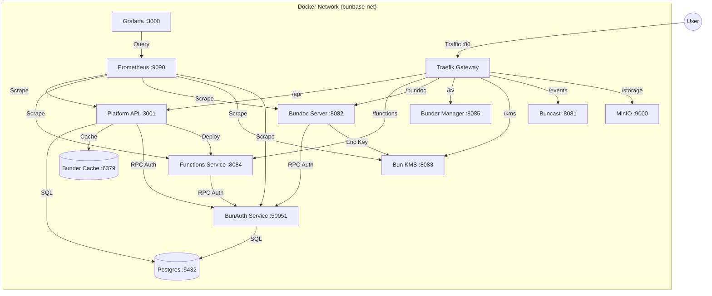

# Platform Integration Architecture

This document describes the comprehensive architecture for integrating all BunBase services into a unified, containerized platform.

## Overview

The system transitions from standalone binaries to a **Docker Compose** managed environment. A centralized **Traefik** gateway handles routing, and a standard **BunAuth** service provides RPC-based authentication. **PostgreSQL** serves as the primary data store, **MinIO** for object storage, and a dedicated **Bunder** instance for system caching. **Prometheus** and **Grafana** provide observability.

## Network Architecture

All services communicate over a shared Docker network `bunbase-net`. External access is restricted to the Traefik entrypoint.

### Port Allocation

| Service            | Internal Port | External Port (Compose) | Route Prefix    |
| ------------------ | ------------- | ----------------------- | --------------- |
| **Traefik**        | 80            | 80                      | `/` (root)      |
| **Platform Web**   | 5173          | 5173                    | `/` (Dashboard) |
| **Platform API**   | 3001          | 3001                    | `/api`          |
| **Buncast**        | 8081          | 8081                    | `/events`       |
| **Bundoc**         | 8080 → 8082   | 8082                    | `/bundoc`       |
| **BunKMS**         | 8080 → 8083   | 8083                    | `/kms`          |
| **Functions**      | 8080 → 8084   | 8084                    | `/functions`    |
| **Bunder Manager** | 8085          | 8085                    | `/kv`           |
| **MinIO API**      | 9000          | 9000                    | `/storage`      |
| **MinIO Console**  | 9001          | 9001                    | -               |
| **BunAuth**        | 50051         | -                       | (Internal RPC)  |
| **Postgres**       | 5432          | 5432                    | -               |
| **Bunder (Sys)**   | 6379          | 6379                    | -               |
| **Prometheus**     | 9090          | 9090                    | -               |
| **Grafana**        | 3000          | 3000                    | `/grafana` (future) |

## Service Roles

1.  **Traefik**: Gateway & Routing.
2.  **BunAuth**: Identity Service (uses Postgres).
3.  **Postgres**: Primary relational store for Platform (Projects, Users) and BunAuth.
4.  **Bunder (System)**: Redis-compatible cache for Platform sessions/data.
5.  **MinIO**: S3-compatible storage for user assets/blobs.
6.  **BunKMS**: Encryption Keys.
7.  **Prometheus/Grafana**: Monitoring Stack.

## Orchestration

The system is managed via `docker-compose.yml`.

### Startup Order & Dependencies

1.  **Level 0 (Foundation)**: `postgres`, `bunder-sys`, `minio`.
    -   Must be healthy before Level 1.
2.  **Level 1 (Infrastructure)**: `bun-auth`, `bun-kms`, `buncast`, `prometheus`.
    -   Depends on Postgres/Bunder.
3.  **Level 2 (Data)**: `bundoc-server`, `bunder-manager`.
    -   Depends on Auth/KMS.
4.  **Level 3 (Logic)**: `functions`, `platform`, `grafana`.
    -   Depends on everything below.
5.  **Level 4 (Gateway)**: `traefik`.

### Health Checks

-   **Postgres**: `pg_isready -U postgres`
-   **MinIO**: `/minio/health/live`
-   **Prometheus**: `/-/healthy`
-   **Go Services**: `/health` endpoint

### Networking

-   **Network Name**: `bunbase-net` (bridge)
-   **Isolation**: No ports exposed to host except `Traefik:80` and `Platform-Web:5173`.
-   **DNS**: Service names resolve automatically (e.g., `http://bun-auth:50051`).

### Volume Strategy

Data persistence is handled via named volumes mapping to host directories:

-   `pg-data`: `/var/lib/postgresql/data`
-   `minio-data`: `/data`
-   `platform-data`: `/app/data` (Legacy/Logs)
-   `functions-data`: `/app/data` (Metadata, Bundles)
-   `bundoc-data`: `/app/data` (User Data)
-   `bunder-data`: `/app/data` (KV Stores)
-   `kms-data`: `/app/data` (Keys, Audit Logs)
-   `prometheus-data`: `/prometheus`
-   `grafana-data`: `/var/lib/grafana`

## Future Considerations

- **Service Mesh**: If complexity grows, consider Connect/Consul instead of direct HTTP.
- **Metrics**: Gather Prometheus metrics from all `/metrics` endpoints via a central scraper.
