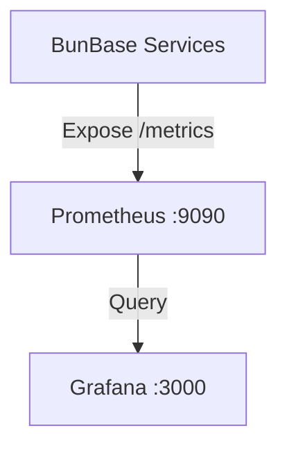

# Monitoring Requirements

We will use **Prometheus** for metrics collection and **Grafana** for visualization.

## Architecture

## Stack
-   **Prometheus**: Scrapes targets every 15s.
-   **Grafana**: Pre-configured dashboards.

## Service Requirements

All services (`platform`, `auth`, `functions`, `bundoc`, `kms`, `manager`) **MUST**:
1.  Import `github.com/prometheus/client_golang/prometheus`.
2.  Expose `GET /metrics` on their main HTTP port (or a dedicated `:9090` if internal).
3.  Instrument standard Go runtime metrics (`go_goroutines`, `go_memstats_*`).

### Standard Metrics
All HTTP servers must implement a middleware to record:
-   `http_requests_total{method, path, status}` (Counter)
-   `http_request_duration_seconds{method, path}` (Histogram)

### Service-Specific Metrics

#### 1. BunAuth
-   `auth_login_total{status}`: Success/Failure counts.
-   `auth_token_issuance__total{type}`: JWTs minted.
-   `auth_token_verification_total{valid}`: Verification checks.

#### 2. Bundoc
-   `bundoc_ops_total{project_id, op}`: CRUD operations per project.
-   `bundoc_active_instances`: Gauge of hot DB instances.
-   `bundoc_kms_fetches_total{status}`: Key fetch success/fail.

#### 3. Functions
-   `fn_invocations_total{func_id, version, status}`: Execution count.
-   `fn_execution_duration_seconds{func_id}`: Execution time.
-   `fn_cold_starts_total`: Count of cold starts.
-   `fn_active_workers`: Gauge of running workers.

#### 4. BunKMS
-   `kms_ops_total{key_id, op}`: Encrypt/Decrypt counts.
-   `kms_key_generations_total`: New keys created.

## Implementation Plan

1.  **Shared Library**: Create `pkg/metrics` in the monorepo (if applicable) or copy-paste a standard `Middleware` function.
2.  **Instrumentation**: Add the middleware to `chi` / `http.ServeMux` in each service.
3.  **Config**: Create `deploy/prometheus/prometheus.yml` to discover targets (static config for now: `host.docker.internal` or docker DNS names).
